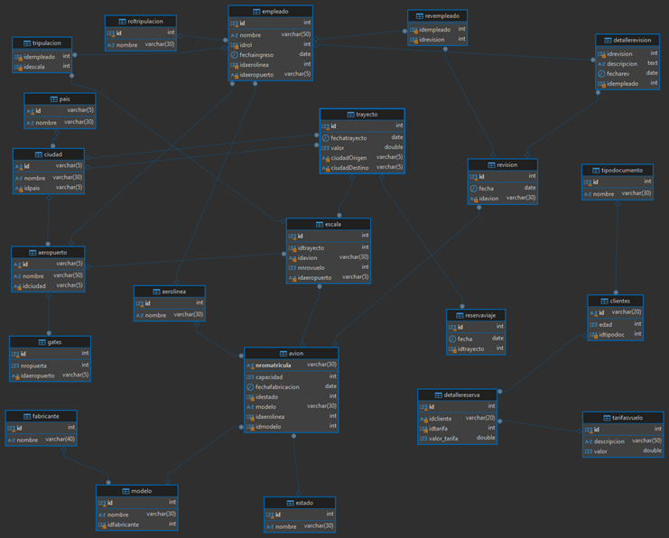

# Trabajo de Aerolínea
Este modelo de base de datos para una aerolínea organiza toda la información clave de vuelos, personal y clientes. Facilita la gestión de trayectos, revisiones de aviones y reservas, proporcionando una estructura clara y eficiente para el funcionamiento diario de la aerolínea.

## Modelo Conceptual
### Entidades y Atributos
1. **Pais**
   - `id` (PK)
   - `nombre`

2. **Ciudad**
   - `id` (PK)
   - `nombre`
   - `idpais` (FK)

3. **Aeropuerto**
   - `id` (PK)
   - `nombre`
   - `idciudad` (FK)

4. **Aerolinea**
   - `id` (PK)
   - `nombre`

5. **Fabricante**
   - `id` (PK)
   - `nombre`

6. **Estado**
   - `id` (PK)
   - `nombre`

7. **Modelo**
   - `id` (PK)
   - `nombre`
   - `idfabricante` (FK)

8. **Avion**
   - `nromatricula` (PK)
   - `capacidad`
   - `fechafabricacion`
   - `idestado` (FK)
   - `modelo`
   - `idaerolinea` (FK)
   - `idmodelo` (FK)

9. **Trayecto**
   - `id` (PK)
   - `fechatrayecto`
   - `valor`
   - `ciudadOrigen` (FK)
   - `ciudadDestino` (FK)

10. **Escala**
   - `id` (PK)
   - `idtrayecto` (FK)
   - `idavion` (FK)
   - `nnrovuelo`
   - `idaeropuerto` (FK)

11. **Gates**
   - `id` (PK)
   - `nropuerta`
   - `idaeropuerto` (FK)

12. **Roltripulacion**
   - `id` (PK)
   - `nombre`

13. **Empleado**
   - `id` (PK)
   - `nombre`
   - `idrol` (FK)
   - `fechaingreso`
   - `idaerolinea` (FK)
   - `idaeropuerto` (FK)

14. **Tripulacion**
   - `idempleado` (FK)
   - `idescala` (FK)

15. **Revision**
   - `id` (PK)
   - `fecha`
   - `idavion` (FK)

16. **RevEmpleado**
   - `idempleado` (FK)
   - `idrevision` (FK)

17. **DetalleRevision**
   - `idrevision` (FK)
   - `descripcion`
   - `fecharev`
   - `idempleado` (FK)

18. **Tipodocumento**
   - `id` (PK)
   - `nombre`

19. **Clientes**
   - `id` (PK)
   - `edad`
   - `idtipodoc` (FK)

20. **Reservaviaje**
   - `id` (PK)
   - `fecha`
   - `idtrayecto` (FK)

21. **Tarifasvuelo**
   - `id` (PK)
   - `descripcion`
   - `valor`

22. **DetalleReserva**
   - `id` (PK)
   - `idcliente` (FK)
   - `idtarifa` (FK)
   - `valortarifa`

### Relaciones
- Un **Pais** tiene muchas **Ciudades**.
- Una **Ciudad** tiene muchos **Aeropuertos**.
- Una **Aerolinea** tiene muchos **Aviones**.
- Un **Fabricante** tiene muchos **Modelos**.
- Un **Modelo** puede estar asociado a muchos **Aviones**.
- Un **Trayecto** tiene muchas **Escalas**.
- Un **Empleado** puede estar en muchas **Tripulaciones**.
- Un **Cliente** puede tener muchas **Reservas**.

---

## Modelo Lógico

### Tablas y Columnas

#### Pais
- `id` VARCHAR(5) PRIMARY KEY
- `nombre` VARCHAR(30)

#### Ciudad
- `id` VARCHAR(5) PRIMARY KEY
- `nombre` VARCHAR(30)
- `idpais` VARCHAR(5) (FK) REFERENCES Pais(id)

#### Aeropuerto
- `id` VARCHAR(5) PRIMARY KEY
- `nombre` VARCHAR(50)
- `idciudad` VARCHAR(5) (FK) REFERENCES Ciudad(id)

#### Aerolinea
- `id` INT AUTO_INCREMENT PRIMARY KEY
- `nombre` VARCHAR(30)

#### Fabricante
- `id` INT AUTO_INCREMENT PRIMARY KEY
- `nombre` VARCHAR(40)

#### Estado
- `id` INT AUTO_INCREMENT PRIMARY KEY
- `nombre` VARCHAR(30)

#### Modelo
- `id` INT AUTO_INCREMENT PRIMARY KEY
- `nombre` VARCHAR(30)
- `idfabricante` INT (FK) REFERENCES Fabricante(id)

#### Avion
- `nromatricula` VARCHAR(30) UNIQUE PRIMARY KEY
- `capacidad` INT
- `fechafabricacion` DATE
- `idestado` INT (FK) REFERENCES Estado(id)
- `modelo` VARCHAR(30)
- `idaerolinea` INT (FK) REFERENCES Aerolinea(id)
- `idmodelo` INT (FK) REFERENCES Modelo(id)

#### Trayecto
- `id` INT AUTO_INCREMENT PRIMARY KEY
- `fechatrayecto` DATE
- `valor` DOUBLE
- `ciudadOrigen` VARCHAR(5) (FK) REFERENCES Ciudad(id)
- `ciudadDestino` VARCHAR(5) (FK) REFERENCES Ciudad(id)

#### Escala
- `id` INT AUTO_INCREMENT PRIMARY KEY
- `idtrayecto` INT (FK) REFERENCES Trayecto(id)
- `idavion` VARCHAR(30) (FK) REFERENCES Avion(nromatricula)
- `nnrovuelo` INT
- `idaeropuerto` VARCHAR(5) (FK) REFERENCES Aeropuerto(id)

#### Gates
- `id` INT PRIMARY KEY
- `nropuerta` INT
- `idaeropuerto` VARCHAR(5) (FK) REFERENCES Aeropuerto(id)

#### Roltripulacion
- `id` INT PRIMARY KEY
- `nombre` VARCHAR(30)

#### Empleado
- `id` INT PRIMARY KEY
- `nombre` VARCHAR(50)
- `idrol` INT (FK) REFERENCES Roltripulacion(id)
- `fechaingreso` DATE
- `idaerolinea` INT (FK) REFERENCES Aerolinea(id)
- `idaeropuerto` VARCHAR(5) (FK) REFERENCES Aeropuerto(id)

#### Tripulacion
- `idempleado` INT (FK) REFERENCES Empleado(id)
- `idescala` INT (FK) REFERENCES Escala(id)

#### Revision
- `id` INT PRIMARY KEY
- `fecha` DATE
- `idavion` VARCHAR(30) (FK) REFERENCES Avion(nromatricula)

#### RevEmpleado
- `idempleado` INT (FK) REFERENCES Empleado(id)
- `idrevision` INT (FK) REFERENCES Revision(id)

#### DetalleRevision
- `idrevision` INT (FK) REFERENCES Revision(id)
- `descripcion` TEXT
- `fecharev` DATE
- `idempleado` INT (FK) REFERENCES Empleado(id)

#### Tipodocumento
- `id` INT AUTO_INCREMENT PRIMARY KEY
- `nombre` VARCHAR(30)

#### Clientes
- `id` VARCHAR(20) PRIMARY KEY
- `edad` INT
- `idtipodoc` INT (FK) REFERENCES Tipodocumento(id)

#### Reservaviaje
- `id` INT AUTO_INCREMENT PRIMARY KEY
- `fecha` DATE
- `idtrayecto` INT (FK) REFERENCES Trayecto(id)

#### Tarifasvuelo
- `id` INT PRIMARY KEY
- `descripcion` VARCHAR(50)
- `valor` DOUBLE

#### DetalleReserva
- `id` INT AUTO_INCREMENT PRIMARY KEY
- `idcliente` VARCHAR(20) (FK) REFERENCES Clientes(id)
- `idtarifa` INT (FK) REFERENCES Tarifasvuelo(id)
- `valortarifa` DOUBLE


### Relaciones y Cardinalidades
1. **Pais**: Un País tiene muchas Ciudades. (1 a N)
2. **Ciudad**: Una Ciudad pertenece a un País (N a 1) y tiene muchos Aeropuertos (1 a N).
3. **Aeropuerto**: Un Aeropuerto pertenece a una Ciudad (N a 1).
4. **Aerolinea**: Una Aerolínea tiene muchos Aviones (1 a N).
5. **Fabricante**: Un Fabricante tiene muchos Modelos (1 a N).
6. **Modelo**: Un Modelo pertenece a un Fabricante (N a 1) y puede estar asociado a muchos Aviones (1 a N).
7. **Avion**: Un Avión pertenece a una Aerolínea (N a 1), tiene un Estado (N a 1), y un Modelo (N a 1).
8. **Trayecto**: Un Trayecto tiene muchas Escalas (1 a N) y un `ciudadOrigen` y `ciudadDestino` (N a 1).
9. **Escala**: Una Escala pertenece a un Trayecto (N a 1), tiene un Avión (N a 1) y un Aeropuerto (N a 1).
10. **Gates**: Un Gate pertenece a un Aeropuerto (N a 1).
11. **Roltripulacion**: Rol de la tripulación tiene muchos Empleados (1 a N).
12. **Empleado**: Empleado tiene un rol y pertenece a una Aerolínea y a un Aeropuerto.
13. **Tripulacion**: Asocia a un Empleado con una Escala.
14. **Revision**: Revisión de un Avión tiene muchos Detalles y empleados asignados.

---

# Modelo Físico
```sql
CREATE TABLE Pais (
    ->   id VARCHAR(5) PRIMARY KEY,
    ->   nombre VARCHAR(30)
    -> );
```

```sql
CREATE TABLE Ciudad (
    ->   id VARCHAR(5) PRIMARY KEY,
    ->   nombre VARCHAR(30),
    ->   idpais VARCHAR(5),
    ->   FOREIGN KEY (idpais) REFERENCES Pais(id)
    -> );
```

```sql
CREATE TABLE Aeropuerto (
    ->   id VARCHAR(5) PRIMARY KEY,
    ->   nombre VARCHAR(50),
    ->   idciudad VARCHAR(5),
    ->   FOREIGN KEY (idciudad) REFERENCES Ciudad(id)
    -> );
```

```sql
CREATE TABLE Aerolinea (
    ->   id INT AUTO_INCREMENT PRIMARY KEY,
    ->   nombre VARCHAR(30)
    -> );
```

```sql
CREATE TABLE Fabricante (
    ->   id INT AUTO_INCREMENT PRIMARY KEY,
    ->   nombre VARCHAR(40)
    -> );
```

```sql
CREATE TABLE Estado (
    ->   id INT AUTO_INCREMENT PRIMARY KEY,
    ->   nombre VARCHAR(30)
    -> );
```

```sql
CREATE TABLE Modelo (
    ->   id INT AUTO_INCREMENT PRIMARY KEY,
    ->   nombre VARCHAR(30),
    ->   idfabricante INT,
    ->   FOREIGN KEY (idfabricante) REFERENCES Fabricante(id)
    -> );
```

```sql
CREATE TABLE Avion (
    ->   nromatricula VARCHAR(30) UNIQUE,
    ->   capacidad INT,
    ->   fechafabricacion DATE,
    ->   idestado INT,
    ->   modelo VARCHAR(30),
    ->   idaerolinea INT,
    ->   idmodelo INT,
    ->   PRIMARY KEY (nromatricula),
    ->   FOREIGN KEY (idestado) REFERENCES Estado(id),
    ->   FOREIGN KEY (idaerolinea) REFERENCES Aerolinea(id),
    ->   FOREIGN KEY (idmodelo) REFERENCES Modelo(id)
    -> );
```

```sql
CREATE TABLE Trayecto (
    ->   id INT AUTO_INCREMENT PRIMARY KEY,
    ->   fechatrayecto DATE,
    ->   valor DOUBLE,
    ->   ciudadOrigen VARCHAR(5),
    ->   ciudadDestino VARCHAR(5),
    ->   FOREIGN KEY (ciudadOrigen) REFERENCES Ciudad(id),
    ->   FOREIGN KEY (ciudadDestino) REFERENCES Ciudad(id)
    -> );
```

```sql
CREATE TABLE Escala (
    ->   id INT AUTO_INCREMENT PRIMARY KEY,
    ->   idtrayecto INT,
    ->   idavion VARCHAR(30),
    ->   nnrovuelo INT,
    ->   idaeropuerto VARCHAR(5),
    ->   FOREIGN KEY (idtrayecto) REFERENCES Trayecto(id),
    ->   FOREIGN KEY (idavion) REFERENCES Avion(nromatricula),
    ->   FOREIGN KEY (idaeropuerto) REFERENCES Aeropuerto(id)
    -> );
```

```sql
CREATE TABLE Gates (
    ->   id INT PRIMARY KEY,
    ->   nropuerta INT,
    ->   idaeropuerto VARCHAR(5),
    ->   FOREIGN KEY (idaeropuerto) REFERENCES Aeropuerto(id)
    -> );
```

```sql
CREATE TABLE Roltripulacion (
    ->   id INT PRIMARY KEY,
    ->   nombre VARCHAR(30)
    -> );
```

```sql
CREATE TABLE Empleado (
    ->   id INT PRIMARY KEY,
    ->   nombre VARCHAR(50),
    ->   idrol INT,
    ->   fechaingreso DATE,
    ->   idaerolinea INT,
    ->   idaeropuerto VARCHAR(5),
    ->   FOREIGN KEY (idrol) REFERENCES Roltripulacion(id),
    ->   FOREIGN KEY (idaerolinea) REFERENCES Aerolinea(id),
    ->   FOREIGN KEY (idaeropuerto) REFERENCES Aeropuerto(id)
    -> );
```

```sql
CREATE TABLE Tripulacion (
    ->   idempleado INT,
    ->   idescala INT,
    ->   FOREIGN KEY (idempleado) REFERENCES Empleado(id),
    ->   FOREIGN KEY (idescala) REFERENCES Escala(id)
    -> );
```

```sql
CREATE TABLE Revision (
    ->   id INT PRIMARY KEY,
    ->   fecha DATE,
    ->   idavion VARCHAR(30),
    ->   FOREIGN KEY (idavion) REFERENCES Avion(nromatricula)
    -> );
```

```sql
CREATE TABLE RevEmpleado (
    ->   idempleado INT,
    ->   idrevision INT,
    ->   FOREIGN KEY (idempleado) REFERENCES Empleado(id),
    ->   FOREIGN KEY (idrevision) REFERENCES Revision(id)
    -> );
```

```sql
CREATE TABLE DetalleRevision (
    ->   idrevision INT,
    ->   descripcion TEXT,
    ->   fecharev DATE,
    ->   idempleado INT,
    ->   FOREIGN KEY (idrevision) REFERENCES Revision(id),
    ->   FOREIGN KEY (idempleado) REFERENCES Empleado(id)
    -> );
```

```sql
CREATE TABLE Tipodocumento (
    ->   id INT AUTO_INCREMENT PRIMARY KEY,
    ->   nombre VARCHAR(30)
    -> );
```

```sql
CREATE TABLE Clientes (
    ->   id VARCHAR(20) PRIMARY KEY,
    ->   edad INT,
    ->   idtipodoc INT,
    ->   FOREIGN KEY (idtipodoc) REFERENCES Tipodocumento(id)
    -> );
```

```sql
CREATE TABLE Reservaviaje (
    ->   id INT AUTO_INCREMENT PRIMARY KEY,
    ->   fecha DATE,
    ->   idtrayecto INT,
    ->   FOREIGN KEY (idtrayecto) REFERENCES Trayecto(id)
    -> );
```

```sql
CREATE TABLE Tarifasvuelo (
    ->   id INT PRIMARY KEY,
    ->   descripcion VARCHAR(50),
    ->   valor DOUBLE
    -> );
```

```sql
CREATE TABLE DetalleReserva (
    ->   id INT AUTO_INCREMENT PRIMARY KEY,
    ->   idcliente VARCHAR(20),
    ->   idtarifa INT,
    ->   valor tarifa DOUBLE,
    ->   FOREIGN KEY (idcliente) REFERENCES Clientes(id),
    ->   FOREIGN KEY (idtarifa) REFERENCES Tarifasvuelo(id)
    -> );
```


- Entregado por: Karen Lorena Cristancho Caceres
