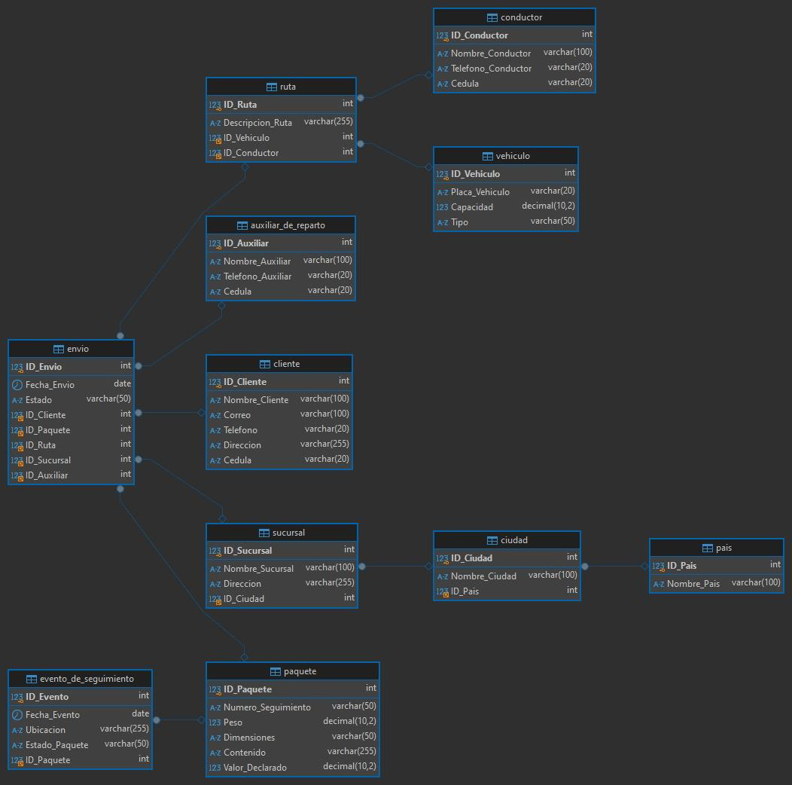

# Trabajo de Logísticas
Entregado por: Karen Lorena Cristancho Caceres

# Modelo Conceptual
## Entidades y Atributos
1. Pais
ID_Pais: Identificador único del país.
Nombre_Pais: Nombre del país.

2. Ciudad
ID_Ciudad: Identificador único de la ciudad.
Nombre_Ciudad: Nombre de la ciudad.
ID_Pais: Referencia al país al que pertenece la ciudad.

3. Sucursal
ID_Sucursal: Identificador único de la sucursal.
Nombre_Sucursal: Nombre de la sucursal.
Direccion: Dirección de la sucursal.
ID_Ciudad: Referencia a la ciudad en la que se encuentra la sucursal.

4. Cliente
ID_Cliente: Identificador único del cliente.
Nombre_Cliente: Nombre completo del cliente.
Correo: Dirección de correo electrónico del cliente.
Telefono: Teléfono de contacto del cliente.
Direccion: Dirección del cliente.
Cedula: Documento de identidad del cliente.

5. Paquete
ID_Paquete: Identificador único del paquete.
Numero_Seguimiento: Número de seguimiento del paquete.
Peso: Peso del paquete.
Dimensiones: Dimensiones del paquete.
Contenido: Descripción del contenido del paquete.
Valor_Declarado: Valor declarado del contenido.

6. Vehiculo
ID_Vehiculo: Identificador único del vehículo.
Placa_Vehiculo: Placa del vehículo.
Capacidad: Capacidad de carga del vehículo.
Tipo: Tipo de vehículo (e.g., camión, furgoneta).

7. Conductor
ID_Conductor: Identificador único del conductor.
Nombre_Conductor: Nombre del conductor.
Telefono_Conductor: Teléfono del conductor.
Cedula: Documento de identidad del conductor.

8. Ruta
ID_Ruta: Identificador único de la ruta.
Descripcion_Ruta: Descripción de la ruta.
ID_Vehiculo: Referencia al vehículo asignado a la ruta.
ID_Conductor: Referencia al conductor asignado a la ruta.
9. Auxiliar_de_Reparto
ID_Auxiliar: Identificador único del auxiliar.
Nombre_Auxiliar: Nombre del auxiliar.
Telefono_Auxiliar: Teléfono del auxiliar.
Cedula: Documento de identidad del auxiliar.

10. Envio
ID_Envio: Identificador único del envío.
Fecha_Envio: Fecha en que se realiza el envío.
Estado: Estado del envío (e.g., En tránsito, Entregado).
ID_Cliente: Referencia al cliente que realiza el envío.
ID_Paquete: Referencia al paquete en el envío.ID_Ruta: Referencia a la ruta asignada para el envío.
ID_Sucursal: Referencia a la sucursal desde la que se envía el paquete.
ID_Auxiliar: Referencia al auxiliar que apoya en el envío.

11. Evento_de_Seguimiento
ID_Evento: Identificador único del evento de seguimiento.
Fecha_Evento: Fecha en que ocurre el evento.
Ubicacion: Ubicación del paquete en ese momento.
Estado_Paquete: Estado actual del paquete en ese evento (e.g., Recibido, En tránsito, Entregado).
ID_Paquete: Referencia al paquete que se está siguiendo.

## Relaciones
 Pais (1) - (N) Ciudad
 Ciudad (1) - (N) Sucursal
 Cliente (1) - (N) Envio
 Paquete (1) - (N) Envio
 Envio (N) - (1) Ruta
 Envio (N) - (1) Sucursal
 Envio (N) - (1) Auxiliar_de_Reparto
 Vehiculo (1) - (N) Ruta
 Conductor (1) - (N) Ruta
 Paquete (1) - (N) Evento_de_Seguimiento

# Modelo Lógico
1. Pais
ID_Pais: INT (PK, AUTO_INCREMENT)
Nombre_Pais: VARCHAR(100) NOT NULL

2. Ciudad
ID_Ciudad: INT (PK, AUTO_INCREMENT)
Nombre_Ciudad: VARCHAR(100) NOT NULL
ID_Pais: INT (FK, referencia a Pais(ID_Pais))

3. Sucursal
ID_Sucursal: INT (PK, AUTO_INCREMENT)
Nombre_Sucursal: VARCHAR(100) NOT NULL
Direccion: VARCHAR(255) NOT NULL
ID_Ciudad: INT (FK, referencia a Ciudad(ID_Ciudad))

4. Cliente
ID_Cliente: INT (PK, AUTO_INCREMENT)
Nombre_Cliente: VARCHAR(100) NOT NULL
Correo: VARCHAR(100) NOT NULL
Telefono: VARCHAR(20)
Direccion: VARCHAR(255)
Cedula: VARCHAR(20) NOT NULL

5. Paquete
ID_Paquete: INT (PK, AUTO_INCREMENT)
Numero_Seguimiento: VARCHAR(50) NOT NULL
Peso: DECIMAL(10, 2)
Dimensiones: VARCHAR(50)
Contenido: VARCHAR(255)
Valor_Declarado: DECIMAL(10, 2)

6. Vehiculo
ID_Vehiculo: INT (PK, AUTO_INCREMENT)
Placa_Vehiculo: VARCHAR(20) NOT NULL
Capacidad: DECIMAL(10, 2)
Tipo: VARCHAR(50)

7. Conductor
ID_Conductor: INT (PK, AUTO_INCREMENT)
Nombre_Conductor: VARCHAR(100) NOT NULL
Telefono_Conductor: VARCHAR(20)
Cedula: VARCHAR(20) NOT NULL

8. Ruta
ID_Ruta: INT (PK, AUTO_INCREMENT)
Descripcion_Ruta: VARCHAR(255) NOT NULL
ID_Vehiculo: INT (FK, referencia a Vehiculo(ID_Vehiculo))
ID_Conductor: INT (FK, referencia a Conductor(ID_Conductor))

9. Auxiliar_de_Reparto
ID_Auxiliar: INT (PK, AUTO_INCREMENT)
Nombre_Auxiliar: VARCHAR(100) NOT NULL
Telefono_Auxiliar: VARCHAR(20)
Cedula: VARCHAR(20) NOT NULL

10. Envio
ID_Envio: INT (PK, AUTO_INCREMENT)
Fecha_Envio: DATE NOT NULL
Estado: VARCHAR(50)
ID_Cliente: INT (FK, referencia a Cliente(ID_Cliente))
ID_Paquete: INT (FK, referencia a Paquete(ID_Paquete))
ID_Ruta: INT (FK, referencia a Ruta(ID_Ruta))
ID_Sucursal: INT (FK, referencia a Sucursal(ID_Sucursal))
ID_Auxiliar: INT (FK, referencia a Auxiliar_de_Reparto(ID_Auxiliar))

11. Evento_de_Seguimiento
ID_Evento: INT (PK, AUTO_INCREMENT)
Fecha_Evento: DATE NOT NULL
Ubicacion: VARCHAR(255) NOT NULL
Estado_Paquete: VARCHAR(50)
ID_Paquete: INT (FK, referencia a Paquete(ID_Paquete))

## Relaciones
1. Pais (1) - (N) Ciudad
Ciudad.ID_Pais referencia Pais.ID_Pais
2. Ciudad (1) - (N) Sucursal
Sucursal.ID_Ciudad referencia Ciudad.ID_Ciudad
3. Cliente (1) - (N) Envio
Envio.ID_Cliente referencia Cliente.ID_Cliente
4. Paquete (1) - (N) Envio
Envio.ID_Paquete referencia Paquete.ID_Paquete
5. Envio (N) - (1) Ruta
Envio.ID_Ruta referencia Ruta.ID_Ruta
6. Envio (N) - (1) Sucursal
Envio.ID_Sucursal referencia Sucursal.ID_Sucursal
7. Envio (N) - (1) Auxiliar_de_Reparto
Envio.ID_Auxiliar referencia Auxiliar_de_Reparto.ID_Auxiliar
8. Vehiculo (1) - (N) Ruta
Ruta.ID_Vehiculo referencia Vehiculo.ID_Vehiculo
9. Conductor (1) - (N) Ruta
Ruta.ID_Conductor referencia Conductor.ID_Conductor
10. Paquete (1) - (N) Evento_de_Seguimiento
Evento_de_Seguimiento.ID_Paquete referencia Paquete.ID_Paquete

# Modelo Físico
Creación de Tablas
CREATE TABLE Pais (
ID_Pais INT AUTO_INCREMENT,
Nombre_Pais VARCHAR(100) NOT NULL,
PRIMARY KEY (ID_Pais)
);

CREATE TABLE Ciudad (
ID_Ciudad INT AUTO_INCREMENT,
Nombre_Ciudad VARCHAR(100) NOT NULL,
ID_Pais INT,
PRIMARY KEY (ID_Ciudad),
CONSTRAINT FK_Ciudad_Pais FOREIGN KEY (ID_Pais) REFERENCES Pais(ID_Pais)
);

CREATE TABLE Sucursal (
ID_Sucursal INT AUTO_INCREMENT,
Nombre_Sucursal VARCHAR(100) NOT NULL,
Direccion VARCHAR(255) NOT NULL,
ID_Ciudad INT,
PRIMARY KEY (ID_Sucursal),
CONSTRAINT FK_Sucursal_Ciudad FOREIGN KEY (ID_Ciudad) REFERENCES Ciudad(ID_Ciudad)
);

CREATE TABLE Cliente (
ID_Cliente INT AUTO_INCREMENT,
Nombre_Cliente VARCHAR(100) NOT NULL,
Correo VARCHAR(100) NOT NULL,
Telefono VARCHAR(20),
Direccion VARCHAR(255),
Cedula VARCHAR(20) NOT NULL,
PRIMARY KEY (ID_Cliente)
);

CREATE TABLE Paquete (
ID_Paquete INT AUTO_INCREMENT,
Numero_Seguimiento VARCHAR(50) NOT NULL,
Peso DECIMAL(10, 2),
Dimensiones VARCHAR(50),
Contenido VARCHAR(255),
Valor_Declarado DECIMAL(10, 2),
PRIMARY KEY (ID_Paquete)
);

CREATE TABLE Vehiculo (
ID_Vehiculo INT AUTO_INCREMENT,
Placa_Vehiculo VARCHAR(20) NOT NULL,
Capacidad DECIMAL(10, 2),
Tipo VARCHAR(50),
PRIMARY KEY (ID_Vehiculo)
);

CREATE TABLE Conductor (
ID_Conductor INT AUTO_INCREMENT,
Nombre_Conductor VARCHAR(100) NOT NULL,
Telefono_Conductor VARCHAR(20),
Cedula VARCHAR(20) NOT NULL,
PRIMARY KEY (ID_Conductor)
);

CREATE TABLE Ruta (
ID_Ruta INT AUTO_INCREMENT,
Descripcion_Ruta VARCHAR(255) NOT NULL,
ID_Vehiculo INT,
ID_Conductor INT,
PRIMARY KEY (ID_Ruta),
CONSTRAINT FK_Ruta_Vehiculo FOREIGN KEY (ID_Vehiculo) REFERENCES Vehiculo(ID_Vehiculo),
CONSTRAINT FK_Ruta_Conductor FOREIGN KEY (ID_Conductor) REFERENCES Conductor(ID_Conductor)
);

CREATE TABLE Auxiliar_de_Reparto (
ID_Auxiliar INT AUTO_INCREMENT,
Nombre_Auxiliar VARCHAR(100) NOT NULL,
Telefono_Auxiliar VARCHAR(20),
Cedula VARCHAR(20) NOT NULL,
PRIMARY KEY (ID_Auxiliar)
);

CREATE TABLE Envio (
ID_Envio INT AUTO_INCREMENT,
Fecha_Envio DATE NOT NULL,
Estado VARCHAR(50),
ID_Cliente INT,
ID_Paquete INT,
ID_Ruta INT,
ID_Sucursal INT,
ID_Auxiliar INT,
PRIMARY KEY (ID_Envio),
CONSTRAINT FK_Envio_Cliente FOREIGN KEY (ID_Cliente) REFERENCES Cliente(ID_Cliente),
CONSTRAINT FK_Envio_Paquete FOREIGN KEY (ID_Paquete) REFERENCES Paquete(ID_Paquete),
CONSTRAINT FK_Envio_Ruta FOREIGN KEY (ID_Ruta) REFERENCES Ruta(ID_Ruta),
CONSTRAINT FK_Envio_Sucursal FOREIGN KEY (ID_Sucursal) REFERENCES Sucursal(ID_Sucursal),
CONSTRAINT FK_Envio_Auxiliar FOREIGN KEY (ID_Auxiliar) REFERENCES Auxiliar_de_Reparto(ID_Auxiliar)
);

CREATE TABLE Evento_de_Seguimiento (
ID_Evento INT AUTO_INCREMENT,
Fecha_Evento DATE NOT NULL,
Ubicacion VARCHAR(255) NOT NULL,
Estado_Paquete VARCHAR(50),
ID_Paquete INT,
PRIMARY KEY (ID_Evento),
CONSTRAINT FK_Evento_Paquete FOREIGN KEY (ID_Paquete) REFERENCES Paquete(ID_Paquete)
);

### Inserción de Datos
1. Insertar datos en la tabla Pais
INSERT INTO Pais (Nombre_Pais) VALUES
('Colombia'),
('México'),
('Argentina');

2. Insertar datos en la tabla Ciudad
INSERT INTO Ciudad (Nombre_Ciudad, ID_Pais) VALUES
('Bogotá', 1), -- 1 es el ID de Colombia
('Medellín', 1),
('Ciudad de México', 2),
('Buenos Aires', 3);

3. Insertar datos en la tabla Sucursal
INSERT INTO Sucursal (Nombre_Sucursal, Direccion, ID_Ciudad) VALUES
('Sucursal Centro', 'Calle 100 #10-10', 1), -- 1 es el ID de Bogotá
('Sucursal Norte', 'Avenida 7 #20-20', 1),
('Sucursal Sur', 'Avenida 6 #15-15', 2),
('Sucursal México', 'Calle Reforma #30', 3);

4. Insertar datos en la tabla Cliente
INSERT INTO Cliente (Nombre_Cliente, Correo, Telefono, Direccion, Cedula) VALUES
('Juan Pérez', 'juanperez@example.com', '3001234567', 'Calle 50 #15-20', '12345678'),
('María Gómez', 'mariagomez@example.com', '3009876543', 'Calle 60 #10-10', '87654321');

5. Insertar datos en la tabla Paquete
INSERT INTO Paquete (Numero_Seguimiento, Peso, Dimensiones, Contenido, Valor_Declarado) VALUES
('ABC123', 2.5, '30x20x10', 'Ropa', 100000),
('XYZ456', 1.0, '15x10x5', 'Libros', 50000);

6. Insertar datos en la tabla Vehiculo
INSERT INTO Vehiculo (Placa_Vehiculo, Capacidad, Tipo) VALUES
('ABC123', 1000.00, 'Camión'),
('XYZ456', 500.00, 'Furgoneta');

7. Insertar datos en la tabla Conductor
INSERT INTO Conductor (Nombre_Conductor, Telefono_Conductor, Cedula) VALUES
('Carlos Rodríguez', '3005555555', '123456789'),
('Ana Martínez', '3006666666', '987654321');

8. Insertar datos en la tabla Ruta
INSERT INTO Ruta (Descripcion_Ruta, ID_Vehiculo, ID_Conductor) VALUES
('Ruta Bogotá - Medellín', 1, 1), -- 1 es el ID del vehículo y conductor
('Ruta Bogotá - Cali', 2, 2);

9. Insertar datos en la tabla Auxiliar de Reparto
INSERT INTO Auxiliar_de_Reparto (Nombre_Auxiliar, Telefono_Auxiliar, Cedula) VALUES
('Luis Fernández', '3007777777', '123123123'),
('Sofía López', '3008888888', '321321321');

10. Insertar datos en la tabla Envio
INSERT INTO Envio (Fecha_Envio, Estado, ID_Cliente, ID_Paquete, ID_Ruta, ID_Sucursal, ID_Auxiliar) VALUES
('2024-10-01', 'En tránsito', 1, 1, 1, 1, 1), -- IDs de Cliente, Paquete, Ruta, Sucursal, Auxiliar
('2024-10-02', 'Entregado', 2, 2, 2, 2, 2);

11. Insertar datos en la tabla Evento de Seguimiento
INSERT INTO Evento_de_Seguimiento (Fecha_Evento, Ubicacion, Estado_Paquete, ID_Paquete) VALUES
('2024-10-01', 'Centro de distribución', 'Recibido', 1),
('2024-10-02', 'Sucursal Norte', 'Entregado', 2);

# CASOS

## Caso 1: Obtener Información Completa de Envíos
SELECT
Envio.ID_Envio,
Envio.Fecha_Envio,
Envio.Estado,
Cliente.Nombre_Cliente,
Cliente.Correo,
Paquete.Numero_Seguimiento,
Paquete.Peso,
Paquete.Contenido,
Ruta.Descripcion_Ruta,
Conductor.Nombre_Conductor,
Sucursal.Nombre_Sucursal,
Sucursal.Direccion
FROM
Envio
JOIN Cliente ON Envio.ID_Cliente = Cliente.ID_Cliente
JOIN Paquete ON Envio.ID_Paquete = Paquete.ID_Paquete
JOIN Ruta ON Envio.ID_Ruta = Ruta.ID_Ruta
JOIN Conductor ON Ruta.ID_Conductor = Conductor.ID_Conductor
JOIN Sucursal ON Envio.ID_Sucursal = Sucursal.ID_Sucursal;

## Caso de Uso 2: Obtener Historial de Envíos de un Cliente
SELECT
Envio.ID_Envio,
Envio.Fecha_Envio,
Envio.Estado,
Paquete.Numero_Seguimiento,
Paquete.Peso,
Paquete.Contenido,
Evento_de_Seguimiento.Fecha_Evento,
Evento_de_Seguimiento.Ubicacion,
Evento_de_Seguimiento.Estado_Paquete
FROM
Envio
JOIN Cliente ON Envio.ID_Cliente = Cliente.ID_Cliente
JOIN Paquete ON Envio.ID_Paquete = Paquete.ID_Paquete
JOIN Evento_de_Seguimiento ON Paquete.ID_Paquete = Evento_de_Seguimiento.ID_Paquete
WHERE
Cliente.Nombre_Cliente = 'Juan Pérez;

## Caso de Uso 3: Listar Conductores y sus Rutas Asignadas
SELECT
Conductor.Nombre_Conductor,
Conductor.Telefono_Conductor,
Ruta.Descripcion_Ruta,
Vehiculo.Placa_Vehiculo,
Vehiculo.Tipo,
Sucursal.Nombre_Sucursal
FROM
Ruta
JOIN Conductor ON Ruta.ID_Conductor = Conductor.ID_Conductor
JOIN Vehiculo ON Ruta.ID_Vehiculo = Vehiculo.ID_Vehiculo
JOIN Envio ON Ruta.ID_Ruta = Envio.ID_Ruta
JOIN Sucursal ON Envio.ID_Sucursal = Sucursal.ID_Sucursal;

## Caso de Uso 4: Obtener Detalles de Rutas y Auxiliares Asignados
SELECT
Ruta.Descripcion_Ruta,
Conductor.Nombre_Conductor,
Vehiculo.Placa_Vehiculo,
Auxiliar_de_Reparto.Nombre_Auxiliar,
Auxiliar_de_Reparto.Telefono_Auxiliar
FROM
Ruta
JOIN Conductor ON Ruta.ID_Conductor = Conductor.ID_Conductor
JOIN Vehiculo ON Ruta.ID_Vehiculo = Vehiculo.ID_Vehiculo
JOIN Envio ON Ruta.ID_Ruta = Envio.ID_Ruta
JOIN Auxiliar_de_Reparto ON Envio.ID_Auxiliar = Auxiliar_de_Reparto.ID_Auxiliar;

## Caso de Uso 5: Generar Reporte de Paquetes por Sucursal y Estado
SELECT
Sucursal.Nombre_Sucursal,
Envio.Estado,
COUNT(Paquete.ID_Paquete) AS Total_Paquetes,
SUM(Paquete.Peso) AS Total_Peso
FROM
Envio
JOIN Paquete ON Envio.ID_Paquete = Paquete.ID_Paquete
JOIN Sucursal ON Envio.ID_Sucursal = Sucursal.ID_Sucursal
GROUP BY
Sucursal.Nombre_Sucursal,
Envio.Estado;

## Caso de Uso 6: Obtener Información Completa de un Paquete y su Historial de Seguimiento
SELECT
Paquete.Numero_Seguimiento,
Paquete.Peso,
Paquete.Dimensiones,
Paquete.Contenido,
Evento_de_Seguimiento.Fecha_Evento,
Evento_de_Seguimiento.Ubicacion,
Evento_de_Seguimiento.Estado_Paquete
FROM
Paquete
JOIN Evento_de_Seguimiento ON Paquete.ID_Paquete = Evento_de_Seguimiento.ID_Paquete
WHERE
Paquete.Numero_Seguimiento = 'ABC123';
