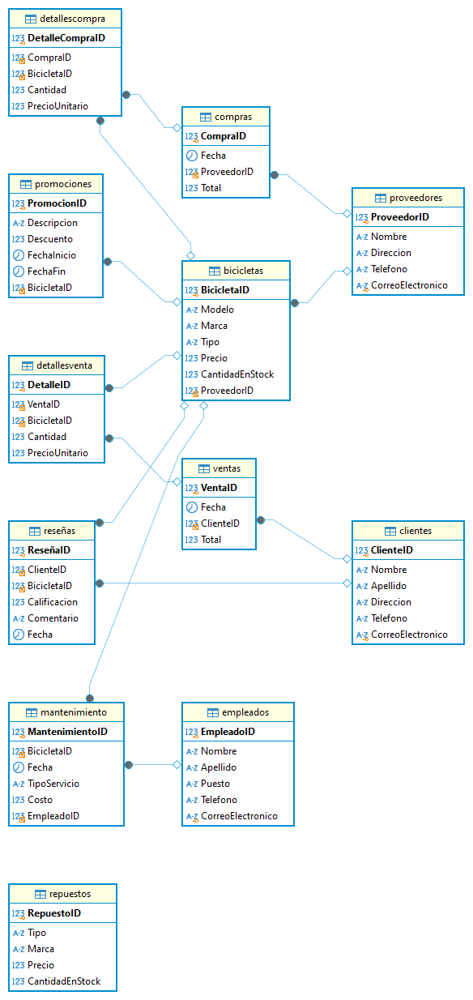

# Trabajo de vtaCiclas
Entregado por: Karen Lorena Cristancho Caceres

# Modelo Conceptual
## Entidades y Atributos
1. Clientes
 Identificador de cliente (PK)
 Nombre
 Apellido
 Dirección
 Teléfono
 Correo Electrónico

2. Proveedores
 ProveedorID (PK)
 Nombre
 Dirección
 Teléfono
 Correo Electrónico

3. Bicicletas
 Identificación de bicicleta (PK)
 Modelo
 Marca
 Tipo
 Precio
 CantidadEnStock
 ProveedorID (FK)

4. Ventas
 VentaID (PK)
 Fecha
 ID de cliente (FK)
 Total

5. DetallesVenta
 Identificación de detalle (PK)
 VentaID (FK)
 Identificación de bicicleta (FK)
 Cantidad
 PrecioUnitario

6. Compras
 CompraID (PK)
 Fecha
 ProveedorID (FK)
 Total

7. DetallesCompra
 DetalleCompraID (PK)
 CompraID (FK)
 Identificación de bicicleta (FK)
 Cantidad
 PrecioUnitario

8. Repuestos
 ID de repuesto (PK)
 Tipo
 Marca
 Precio
 CantidadEnStock

9. Empleados
 Identificación de empleado (PK)
 Nombre
 Apellido
 Puesto
 Teléfono
 Correo Electrónico

10. Promociones
 ID de promoción (PK)
 Descripción
 Descuento
 FechaInicio
 FechaFin

11. Reseñas
 ID de reseña (PK)
 ID de cliente (FK)
 Identificación de bicicleta (FK)
 Calificación
 Comentario
 Fecha

12. Mantenimiento
 ID de mantenimiento (PK)
 Identificación de bicicleta (FK)
 Fecha
 Tipo de servicio
 Costo

## Relaciones
 Clientes a Ventas : Un cliente puede realizar muchas ventas (1:N).
 Ventas a DetallesVenta : Una venta puede tener muchos detalles (1:N).
 Bicicletas a DetallesVenta : Una bicicleta puede estar en muchos detalles de venta (1:N).

 Proveedores de bicicletas : Un proveedor puede suministrar muchas bicicletas (1:N).
 Compras a DetallesCompra : Una compra puede tener muchos detalles (1:N).
 Bicicletas a DetallesCompra : Una bicicleta puede estar en muchos detalles de compra (1:N).

 Clientes a Reseñas : Un cliente puede dejar muchas reseñas (1:N).
 Bicicletas a Reseñas : Una bicicleta puede tener muchas reseñas (1:N).
 Bicicletas a Mantenimiento : Una bicicleta puede tener muchos registros de mantenimiento (1:N).

# Modelo Lógico
## Entidades y Atributos
1. Cliente
 Atributos :
 ClienteID (Identificador único)
 Nombre
 Apellido
 Dirección
 Teléfono
 Correo Electrónico

2. Proveedor
 Atributos :
 ProveedorID (Identificador único)
 Nombre
 Dirección
 Teléfono
 Correo Electrónico

3. Bicicleta
 Atributos :
 BicicletaID (Identificador único)
 Modelo
 Marca
 Tipo
 Precio
 Cantidad en stock

4. Venta
 Atributos :
 VentaID (Identificador único)
 Fecha
 Total

5. Detalle de Venta
 Atributos :
 DetalleID (Identificador único)
 Cantidad
 Precio Unitario

6. Compra
 Atributos :
 CompraID (Identificador único)
 Fecha
 Total

7. Detalle de compra
 Atributos :
 DetalleCompraID (Identificador único)
 Cantidad
 Precio Unitario

8. Repuesto
 Atributos :
 RepuestoID (Identificador único)
 Tipo
 Marca
 Precio
 Cantidad en stock

9. Empleado
 Atributos :
 EmpleadoID (Identificador único)
 Nombre
 Apellido
 Puesto
 Teléfono
 Correo Electrónico

10. Promoción
 Atributos :
 PromocionID (Identificador único)
 Descripción
 Descuento
 Fecha de inicio
 Fecha de fin

11. Reseña
 Atributos :
 ReseñaID (Identificador único)
 Calificación
 Comentario
 Fecha

12. Mantenimiento
 Atributos :
 MantenimientoID (Identificador único)
 Tipo de servicio
 Costo
 Fecha

## Relaciones
 Cliente realiza Venta : Un cliente puede realizar muchas ventas (1:N).
 Venta tiene Detalle de Venta : Una venta puede tener muchos detalles (1:N).
 Bicicleta está en Detalle de Venta : Una bicicleta puede estar en muchos detalles de venta (1:N).

 Proveedor suministra bicicletas : Un proveedor puede suministrar muchas bicicletas (1:N).

 Compra tiene Detalle de Compra : Una compra puede tener muchos detalles (1:N).

 Bicicleta está en Detalle de Compra : Una bicicleta puede estar en muchos detalles de compra (1:N).

 Cliente deja Reseña : Un cliente puede dejar muchas reseñas (1:N).

 Bicicleta tiene Reseña : Ua bicicleta puede tener muchas reseñas (1:N).

 Bicicleta tiene Mantenimiento : Una bicicleta puede tener muchos registros de mantenimiento (1:N).

# MODELO FISICO
CREATE TABLE Clientes (
ClienteID INT PRIMARY KEY AUTO_INCREMENT,
Nombre VARCHAR(50) NOT NULL,
Apellido VARCHAR(50) NOT NULL,
Direccion VARCHAR(100),
Telefono VARCHAR(15),
CorreoElectronico VARCHAR(100) UNIQUE
);

CREATE TABLE Proveedores (
ProveedorID INT PRIMARY KEY AUTO_INCREMENT,
Nombre VARCHAR(50) NOT NULL,
Direccion VARCHAR(100),
Telefono VARCHAR(15),
CorreoElectronico VARCHAR(100) UNIQUE
);

CREATE TABLE Bicicletas (
BicicletaID INT PRIMARY KEY AUTO_INCREMENT,
Modelo VARCHAR(50) NOT NULL,
Marca VARCHAR(50) NOT NULL,
Tipo VARCHAR(30),
Precio DECIMAL(10, 2) NOT NULL,
CantidadEnStock INT NOT NULL,
ProveedorID INT,
FOREIGN KEY (ProveedorID) REFERENCES Proveedores(ProveedorID)
);

CREATE TABLE Ventas (
VentaID INT PRIMARY KEY AUTO_INCREMENT,
Fecha DATETIME NOT NULL,
ClienteID INT,
Total DECIMAL(10, 2) NOT NULL,
FOREIGN KEY (ClienteID) REFERENCES Clientes(ClienteID)
);

CREATE TABLE DetallesVenta (
DetalleID INT PRIMARY KEY AUTO_INCREMENT,
VentaID INT,
BicicletaID INT,
Cantidad INT NOT NULL,
PrecioUnitario DECIMAL(10, 2) NOT NULL,
FOREIGN KEY (VentaID) REFERENCES Ventas(VentaID),
FOREIGN KEY (BicicletaID) REFERENCES Bicicletas(BicicletaID)
);

CREATE TABLE Compras (
CompraID INT PRIMARY KEY AUTO_INCREMENT,
Fecha DATETIME NOT NULL,
ProveedorID INT,
Total DECIMAL(10, 2) NOT NULL,
FOREIGN KEY (ProveedorID) REFERENCES Proveedores(ProveedorID)
);

CREATE TABLE DetallesCompra (
DetalleCompraID INT PRIMARY KEY AUTO_INCREMENT,
CompraID INT,
BicicletaID INT,
Cantidad INT NOT NULL,
PrecioUnitario DECIMAL(10, 2) NOT NULL,
FOREIGN KEY (CompraID) REFERENCES Compras(CompraID),
FOREIGN KEY (BicicletaID) REFERENCES Bicicletas(BicicletaID)
);

CREATE TABLE Repuestos (
RepuestoID INT PRIMARY KEY AUTO_INCREMENT,
Tipo VARCHAR(50),
Marca VARCHAR(50),
Precio DECIMAL(10, 2) NOT NULL,
CantidadEnStock INT NOT NULL
);

CREATE TABLE Empleados (
EmpleadoID INT PRIMARY KEY AUTO_INCREMENT,
Nombre VARCHAR(50) NOT NULL,
Apellido VARCHAR(50) NOT NULL,
Puesto VARCHAR(50),
Telefono VARCHAR(15),
CorreoElectronico VARCHAR(100) UNIQUE
);

CREATE TABLE Promociones (
PromocionID INT PRIMARY KEY AUTO_INCREMENT,
Descripcion VARCHAR(100),
Descuento DECIMAL(5, 2),
FechaInicio DATETIME,
FechaFin DATETIME,
BicicletaID INT,
FOREIGN KEY (BicicletaID) REFERENCES Bicicletas(BicicletaID)
);

CREATE TABLE Reseñas (
ReseñaID INT PRIMARY KEY AUTO_INCREMENT,
ClienteID INT,
BicicletaID INT,
Calificacion INT CHECK (Calificacion BETWEEN 1 AND 5),
Comentario TEXT,
Fecha DATETIME NOT NULL,
FOREIGN KEY (ClienteID) REFERENCES Clientes(ClienteID),
FOREIGN KEY (BicicletaID) REFERENCES Bicicletas(BicicletaID)
);

CREATE TABLE Mantenimiento (
MantenimientoID INT PRIMARY KEY AUTO_INCREMENT,
BicicletaID INT,
Fecha DATETIME NOT NULL,
TipoServicio VARCHAR(100) NOT NULL,
Costo DECIMAL(10, 2) NOT NULL,
EmpleadoID INT,
FOREIGN KEY (BicicletaID) REFERENCES Bicicletas(BicicletaID),
FOREIGN KEY (EmpleadoID) REFERENCES Empleados(EmpleadoID)
);

